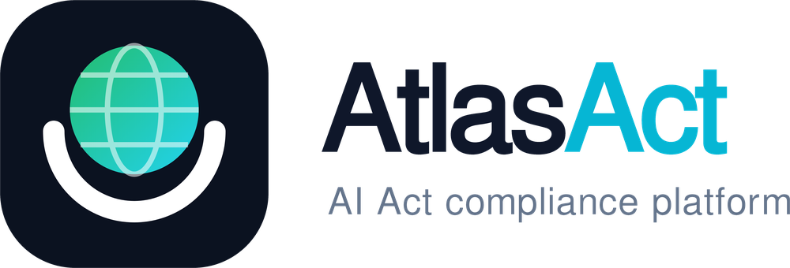

# AtlasAct

Dashboard to inventory AI systems and classify them by EU AI Act risk level (prohibited, high, limited, minimal), with the obligations each level implies and an exportable report.

> Decision-support only. Not legal advice.

## Run
Static site, no build step: `npx serve .` or enable GitHub Pages on the main branch.

## Test
`node --test`

## Roadmap
- LLM-assisted classification from a free-text description (human confirms)
- PDF export per system
- Import/export JSON, multi-user backend
